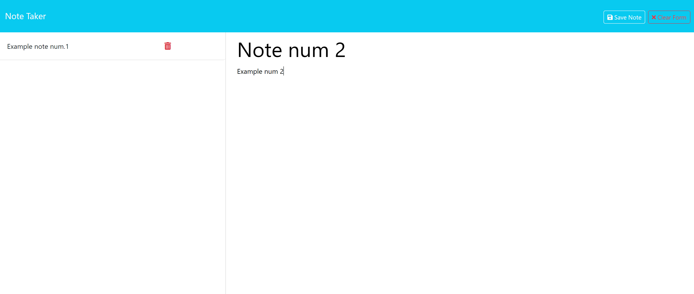

# Note-Taker

## Description
This project was modified from a starter code to create and fix an application that will allow the user to write and save notes.

The principal things that were added are mostly from the back-end part, adding an **'index.js'**, and fixing the **'dependencies"** (*express, and uuid*). We use this to be able to host a server and to generate diferent id's on each of the newly created notes.

One of the principal challenges encountered in this project, was to be able to direct the path's to each of the routes, and to learn how DELETE worked.

### Running:
To run the project, you just need to open the URL, and a page would be presented with a clickable button to write a new note, after clicking it, you will be presentes with a new prompt were you can add a new note; after writing it, at the top right of the page, you will see 2 buttons (save or clear), depending of what you want to do, you can save the note, and it will be added to the list of notes, at the left part of the webpage.

You can also erase notes independently when pressing the red trashcan icon that appears on each note.

If you also want to go directly to the notes list, you can add '*/api/notes*' at the end of the URL, to be directed to route of the file.

---
### Application image example:

---

### Info:
Github repository: https://github.com/BryanGC96/Note-Taker

Application URL: https://peaceful-bastion-64478-d37d38b4fcf9.herokuapp.com/
